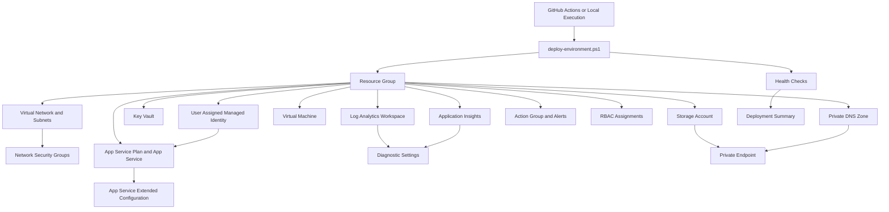

# Cloud Org Infra

## Overview

Cloud Org Infra is a modular Azure infrastructure automation framework built with PowerShell and Azure REST APIs.

The project focuses on repeatable, idempotent, and enterprise-oriented infrastructure provisioning across Azure environments.

It automates the deployment of core cloud infrastructure components while enforcing operational consistency, standardized naming, centralized observability, identity-based security, private networking, and deployment validation.

This repository was designed to simulate real-world cloud engineering and infrastructure operations patterns commonly found in enterprise Azure environments.

---

## Key Features

* Modular Infrastructure as Code (IaC) using PowerShell
* Idempotent deployments safe for repeated execution
* Enterprise-style naming and tagging standards
* Centralized infrastructure orchestration
* Azure REST API integration for advanced scenarios
* GitHub Actions with Azure OIDC authentication
* Security-focused infrastructure configuration
* User Assigned Managed Identity integration
* Private Endpoint and Private DNS integration
* Centralized diagnostics and observability
* RBAC automation and access standardization
* Environment health validation and reporting
* Deployment validation and execution summaries
* Start and stop automation for cost control

---

## Architecture Overview



The deployment flow follows a dependency-aware orchestration model to ensure consistent and predictable infrastructure provisioning.

Additional architecture documentation and detailed diagrams are available under:

* `/architecture`
* `/documentation`
* `/security`
* `/operations`

---

## Core Infrastructure Components

Each environment can provision:

* Resource Groups
* Virtual Networks and Subnets
* Network Security Groups
* Storage Accounts
* Azure Key Vault
* User Assigned Managed Identity
* App Service Plans and App Services
* Virtual Machines
* Log Analytics Workspace
* Application Insights
* Azure Monitor Diagnostics
* Action Groups and Alerting
* RBAC Assignments
* Private DNS Zones
* Private Endpoints
* Environment Health Validation

---

## Security Model

Cloud Org Infra applies security-oriented defaults and infrastructure hardening patterns.

Security-related capabilities include:

* HTTPS-only App Services
* Minimum TLS version enforcement
* User Assigned Managed Identity
* Passwordless authentication between Azure services
* Azure Key Vault integration
* Private Endpoint support
* Private DNS integration
* Role-Based Access Control (RBAC)
* Purge protection validation
* Secure container permissions
* Centralized diagnostics and monitoring

Detailed security documentation is available under:

* `/security`
* `/documentation`

---

## Observability and Monitoring

The platform includes centralized observability components designed for operational visibility and troubleshooting.

Configured services include:

* Log Analytics Workspace
* Application Insights
* Azure Diagnostic Settings
* Azure Monitor Action Groups
* Infrastructure Health Checks
* Deployment Validation Reporting

Diagnostics are configured automatically during deployment and routed centrally into Log Analytics.

---

## Identity

The environment creates a User Assigned Managed Identity and attaches it to the App Service.

This enables passwordless authentication between Azure services and prepares the environment for secure Key Vault access without storing credentials in code.

Benefits:

* No client secrets in application code
* No password rotation for service-to-service authentication
* Reusable identity lifecycle
* Azure RBAC integration
* Enterprise-ready authentication pattern

---

## Private Networking

The environment includes Private Endpoint and Private DNS integration for secure access to Azure PaaS services.

Current implementation:

* Storage Account Blob service exposed through Private Endpoint
* Private DNS Zone for `privatelink.blob.core.windows.net`
* Private Endpoint connected to the application subnet
* DNS records managed through Private DNS Zone Group

This reduces public exposure and prepares the environment for enterprise-grade network isolation.

---

## Backup and Recovery

The environment includes:

* Recovery Services Vault
* VM Backup Policies
* Automated VM Protection
* Recovery Point validation
* On-demand backup support
* GitHub Actions automation

---

## Idempotent Deployment Model

All deployment modules are designed to be idempotent.

This means:

* Existing resources are safely reused
* Missing components are automatically provisioned
* Re-running the same deployment does not create duplicate infrastructure
* Infrastructure state remains consistent across repeated executions

This operational model aligns with modern Infrastructure as Code and DevOps deployment practices.

---

## Standardized Naming Convention

Example naming patterns:

* `rg-core-dev-weu`
* `vnet-core-dev-weu`
* `nsg-core-dev-weu`
* `stcoredevweuXXXXXX`
* `kvcoredevweuXXXXXX`
* `mi-core-dev-weu`
* `vm-dev-core-weu-01`
* `asp-core-dev-weu`
* `app-core-dev-weu`
* `law-core-dev-weu`
* `appi-core-dev-weu`
* `ag-core-dev-weu`
* `pe-storage-dev-weu`

This structure improves:

* Resource discoverability
* Environment consistency
* Operational clarity
* Governance alignment
* Enterprise scalability

---

## Deployment Flow

Primary orchestration entrypoint:

```powershell
automation/deploy-environment.ps1
```

Execution sequence:

1. `create-rg.ps1`
2. `create-network.ps1`
3. `create-nsgs.ps1`
4. `create-storage.ps1`
5. `create-keyvault.ps1`
6. `create-managed-identity.ps1`
7. `create-vm.ps1`
8. `create-appservice.ps1`
9. `create-appservice-extended.ps1`
10. `create-loganalytics.ps1`
11. `create-appinsights.ps1`
12. `create-diagnostics.ps1`
13. `create-alerts.ps1`
14. `create-rbac.ps1`
15. `create-dns.ps1`
16. `create-private-endpoint.ps1`
17. `create-healthchecks.ps1`
18. `New-DeploymentSummary.ps1`

Each deployment module is designed to be modular, reusable, and independently maintainable.

---

## Deployment Example

Example deployment:

```powershell
cd automation

.\deploy-environment.ps1 `
  -Environment dev `
  -App core `
  -Region weu `
  -Location westeurope
```

This deployment provisions:

* Networking
* Security
* Storage
* Identity
* Virtual Machines
* Application Hosting
* Monitoring
* Diagnostics
* RBAC
* Private Networking
* Validation

in a fully automated sequence.

---

## Requirements

* Microsoft Azure Subscription
* PowerShell 7+
* Az PowerShell Modules
* Azure authentication via:

  * `Connect-AzAccount`
    OR
  * GitHub Actions OIDC authentication
    OR
  * Service Principal credentials

Required environment variables for GitHub Actions OIDC authentication:

```text
AZURE_CLIENT_ID
AZURE_TENANT_ID
AZURE_SUBSCRIPTION_ID
```

Required environment variables for Service Principal authentication:

```text
AZURE_CLIENT_ID
AZURE_CLIENT_SECRET
AZURE_TENANT_ID
AZURE_SUBSCRIPTION_ID
```

---

## CI/CD Integration

The project is designed for CI/CD execution using:

* GitHub Actions
* Azure OIDC authentication
* Service Principal authentication
* Validation workflows
* Environment deployment orchestration
* Start Environment workflow
* Stop Environment workflow

Typical pipeline flow:

1. Checkout repository
2. Install PowerShell 7
3. Install Az modules
4. Authenticate to Azure
5. Execute deployment orchestration
6. Run health validation
7. Generate deployment summary

The same orchestration flow can be reused across:

* Development
* Testing
* Production

---

## Documentation Structure

| Directory        | Purpose                                                    |
| ---------------- | ---------------------------------------------------------- |
| `/architecture`  | High-level architecture diagrams and infrastructure design |
| `/documentation` | Detailed module and deployment documentation               |
| `/operations`    | Operational workflows, runbooks, and procedures            |
| `/security`      | Security baselines, RBAC, and identity documentation       |
| `/policy`        | Governance and Azure Policy examples                       |
| `/automation`    | Infrastructure deployment orchestration and modules        |

---

## Real-World Operational Focus

The project intentionally focuses on operational infrastructure concerns commonly encountered in enterprise environments, including:

* Infrastructure consistency
* Centralized monitoring
* Secure defaults
* Environment validation
* Deployment repeatability
* RBAC governance
* Identity-based access
* Private networking
* Diagnostics automation
* Infrastructure hardening
* Dependency-aware orchestration

---

## Roadmap

Planned future enhancements include:

* Terraform-based Cloud Org Infra v2
* Multi-environment expansion
* Extended CI/CD templates
* Application Gateway and WAF support
* AKS integration
* Optional SQL and PostgreSQL modules
* Policy-as-Code integration
* Advanced observability dashboards
* Remote state management
* Key Vault secret access using Managed Identity

---

## License

Internal use and portfolio demonstration purposes only.

Not intended for commercial redistribution without permission.

---

## Author

Designed with a focus on:

* Infrastructure automation
* Cloud operations
* Observability
* Security-oriented architecture
* Identity-based access
* Private networking
* Long-term maintainability
* Modular engineering practices
