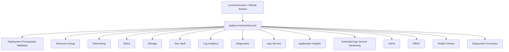

# cloud-org-infra - Automation Engine

## Overview

The `/automation` layer represents the operational execution engine of cloud-org-infra.

It contains the orchestration logic, infrastructure provisioning modules, deployment validation workflows, health checks, and operational automation used to deploy and manage Azure environments in a repeatable and idempotent manner.

The automation framework is designed around modular Infrastructure as Code principles using PowerShell and Azure REST APIs.

---

## Automation Objectives

The automation layer is responsible for:

* Provisioning Azure infrastructure consistently across environments
* Enforcing standardized naming and tagging conventions
* Reducing manual deployment operations
* Providing safe re-runnable deployments through idempotent logic
* Automating monitoring, diagnostics, and validation
* Supporting CI/CD execution through GitHub Actions and Azure DevOps
* Enabling operational visibility and deployment reporting

---

## Automation Architecture



The orchestration layer executes modules in a dependency-aware order to ensure consistent infrastructure provisioning.

---

## Main Orchestration Entrypoint

Primary deployment entrypoint:

```powershell
./deploy-environment.ps1
```

This orchestrator:

* Ensures Azure authentication context exists
* Selects the correct Azure subscription
* Validates deployment prerequisites
* Executes infrastructure modules sequentially
* Runs environment health validation
* Generates centralized deployment summaries
* Supports local and CI/CD execution

---

## Deployment Example

```powershell
cd automation

.\deploy-environment.ps1 `
  -Environment dev `
  -App core `
  -Region weu `
  -Location westeurope
```

---

## Infrastructure Modules

| Module                                | Purpose                                                |
| ------------------------------------- | ------------------------------------------------------ |
| `create-rg.ps1`                       | Resource Group provisioning                            |
| `create-network.ps1`                  | Virtual Network and subnet provisioning                |
| `create-nsgs.ps1`                     | Network Security Group creation and subnet association |
| `create-storage.ps1`                  | Storage Account and container provisioning             |
| `create-keyvault.ps1`                 | Azure Key Vault provisioning                           |
| `create-keyvault-privateendpoint.ps1` | Private Endpoint and Private DNS integration           |
| `create-loganalytics.ps1`             | Log Analytics Workspace provisioning                   |
| `create-diagnostics.ps1`              | Centralized Azure diagnostics configuration            |
| `create-appservice.ps1`               | App Service Plan and Web App provisioning              |
| `create-appinsights.ps1`              | Application Insights integration                       |
| `create-appservice-extended.ps1`      | App Service hardening and enterprise configuration     |
| `create-alerts.ps1`                   | Azure Monitor Action Groups and alerting               |
| `create-rbac.ps1`                     | RBAC assignment automation                             |
| `create-healthchecks.ps1`             | Environment validation and operational scoring         |
| `cleanup.ps1`                         | Environment teardown and cleanup                       |

---

## Idempotent Deployment Model

All infrastructure modules are designed to be idempotent.

This means:

* Existing resources are reused safely
* Missing resources are provisioned automatically
* Duplicate infrastructure is avoided
* Re-running deployments maintains environment consistency
* Infrastructure state remains predictable across executions

This approach aligns with modern Infrastructure as Code and DevOps deployment practices.

---

## Standardized Naming Model

Infrastructure resources follow deterministic naming conventions.

Examples:

* `rg-core-dev-weu`
* `vnet-core-dev-weu`
* `nsg-core-dev-weu`
* `stcoredevweuXXXXXX`
* `kvcoredevweuXXXXXX`
* `law-core-dev-weu`
* `appi-core-dev-weu`
* `app-core-dev-weu`
* `ag-core-dev-weu`

This structure improves:

* Resource discoverability
* Environment consistency
* Governance alignment
* Operational readability
* Enterprise scalability

---

## Tagging Strategy

All resources inherit standardized tags.

Default tags:

```text
environment
app
region
owner
```

Tagging enables:

* Cost tracking
* Governance
* Resource filtering
* Automation targeting
* Operational reporting

---

## Authentication Model

The automation engine supports:

### Local Interactive Authentication

```powershell
Connect-AzAccount
```

### Service Principal Authentication

Supported environment variables:

```text
AZURE_CLIENT_ID
AZURE_CLIENT_SECRET
AZURE_TENANT_ID
AZURE_SUBSCRIPTION_ID
```

### GitHub Actions OIDC Authentication

The project also supports Azure OIDC federation for passwordless CI/CD authentication.

This enables:

* Temporary authentication tokens
* Reduced secret management
* Improved CI/CD security posture
* GitHub-native workload identity federation

---

## Execution Safety Features

The automation engine includes multiple operational safety mechanisms.

### Deployment Validation

The orchestration layer validates:

* Azure authentication context
* Subscription selection
* Required modules
* Parameter integrity
* Module availability

### SupportsShouldProcess

Most modules support:

* `-WhatIf`
* `-Confirm`

This enables safer execution and deployment previews.

### Error Handling

Scripts use:

```powershell
$ErrorActionPreference = "Stop"
```

to enforce strict execution behavior.

---

## Diagnostics and Observability

The automation framework configures centralized diagnostics automatically.

Integrated services:

* Log Analytics Workspace
* Application Insights
* Azure Diagnostic Settings
* Azure Monitor Action Groups
* Health Check Reporting
* Deployment Summaries

The diagnostics layer routes logs and metrics centrally into Log Analytics for operational visibility.

---

## Health Validation System

The environment validation framework performs operational verification checks for:

* Resource Group existence
* Tagging compliance
* VNet configuration
* NSG presence
* Storage security
* Key Vault hardening
* App Service HTTPS enforcement
* Diagnostics configuration
* Alerting configuration
* RBAC validation

The system generates:

* Human-readable operational reports
* JSON summaries for automation pipelines
* Environment health scoring
* Severity classification

---

## CI/CD Integration

The automation framework is designed for pipeline execution.

Supported scenarios:

* GitHub Actions
* Azure DevOps
* Multi-environment deployments
* Validation-only workflows
* Non-destructive environment audits
* Automated infrastructure provisioning

Typical pipeline flow:

1. Checkout repository
2. Install PowerShell 7
3. Install Az modules
4. Authenticate to Azure
5. Execute deployment orchestration
6. Run health checks
7. Generate deployment summary

---

## Local PowerShell Execution

On some Windows systems, PowerShell execution policy restrictions may block unsigned scripts.

Temporary execution policy override for the current session:

```powershell
Set-ExecutionPolicy -Scope Process -ExecutionPolicy Bypass -Force
```

This change applies only to the active PowerShell session.

---

## Cleanup Operations

Environment cleanup:

```powershell
.\cleanup.ps1 `
  -Env dev `
  -Region weu `
  -AppName core `
  -Location westeurope `
  -Force
```

The cleanup operation removes the target Resource Group and all associated infrastructure resources.

---

## Repository Structure

| Directory        | Purpose                                         |
| ---------------- | ----------------------------------------------- |
| `/automation`    | Infrastructure orchestration and provisioning   |
| `/architecture`  | Infrastructure architecture diagrams and design |
| `/documentation` | Detailed module documentation                   |
| `/security`      | Security model and RBAC documentation           |
| `/operations`    | Operational procedures and workflows            |
| `/policy`        | Governance and Azure Policy examples            |

---

## Operational Design Principles

The automation framework follows several engineering principles:

* Modular design
* Idempotent execution
* Deterministic naming
* Centralized observability
* Security-oriented defaults
* Reusable infrastructure patterns
* Dependency-aware orchestration
* Operational validation and reporting

---

## Future Enhancements

Planned roadmap items:

* Terraform-based cloud-org-infra-v2
* Extended monitoring dashboards
* Application Gateway and WAF integration
* AKS integration modules
* SQL and PostgreSQL modules
* Advanced Policy-as-Code integration
* Multi-region orchestration support
* Remote state and deployment tracking

---

## Additional Documentation

Detailed technical documentation is available under:

* `/documentation`
* `/architecture`
* `/security`
* `/operations`

Each infrastructure module includes implementation-focused documentation and operational context.
