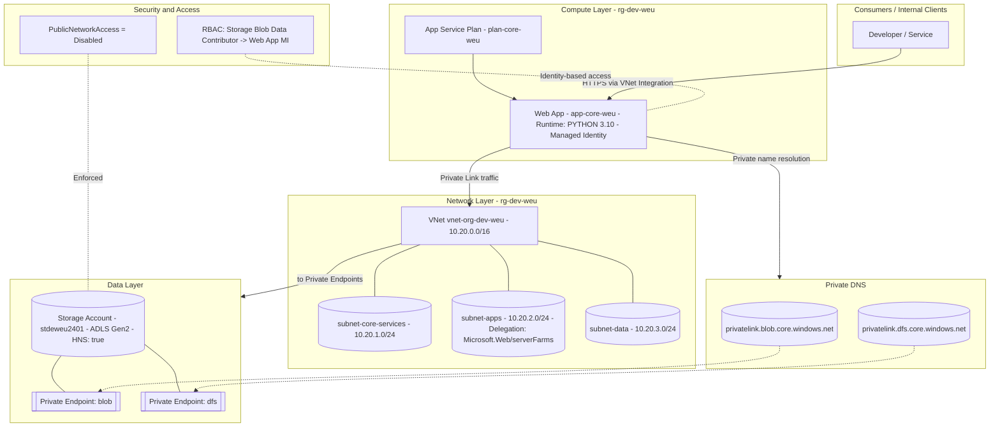

# Infrastructure Overview

This diagram provides a high-level view of the core Azure infrastructure used for the environment.  
It highlights the main layers and how they interact:

- **Compute Layer** — Azure App Service hosting the web app (Python 3.10, Managed Identity).
- **Network Layer** — Virtual Network (VNet) with segregated subnets for core services, apps, and data.
- **Data Layer** — ADLS Gen2 storage account with private endpoints for secure blob and DFS access.
- **Private DNS** — Name resolution for private endpoints.
- **Security & Access** — Identity-based access control (RBAC) and restricted public network access.

Below is the visual representation of the architecture:

